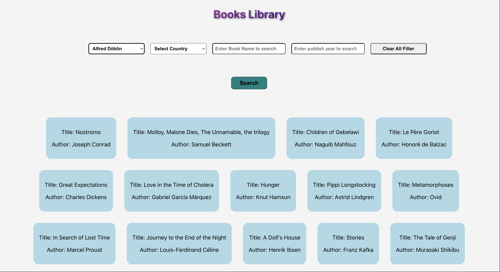

# Book-Search-Engine 📚



## About 📝
Book-Search-Engine is a full-stack project designed to implement and showcase my learnings. It features a simple interface connected to a server and database, fetching books based on specified parameters.

## Tech Used 💻
- JavaScript
- React.js
- Node.js
- MongoDB
- HTML 
- CSS 
- DOM

## Installation 🛠️
The repository contains two separate directories for the backend and frontend.

1. Clone the repository:
```
git clone https://github.com/Akhilesh-max/Book-Search-Engine.git
```

2. Navigate to the backend folder, install dependencies, and start the server:
```
cd backend
```
```
npm install
```
```
npm start
```

3. Open another terminal, navigate to the frontend folder, install dependencies, and start the application:
 ```
 cd frontend 
```
```
npm install 
```
```
npm start
 ```

## Structure 🏗️

### Backend

* The `backend` directory contains:
- `models` folder for defining data structures.
- `routes/api` folder containing routing files.
- Configuration files like `.gitignore`, `config.js`.
- Package files: `package-lock.json`, `package.json`.
- The main server file: `server.js`.

### Frontend

As per the provided image:

* The `frontend` directory consists of:
- A public folder containing static files.
- A source (`src`) folder with:
  * Styling file: `App.css`.
  * Main component file: `App.js`.
  * Test file: ‘App.test.js’.
  * Book component: ‘book.js’.
  * Index styling and JS files: ‘index.css’, ‘index.js’.
  * Other utility files like ‘logo.svg’, ‘reportWebVitals.js’, ‘setupTests.js’.
- Configuration and package files similar to those in the backend.

## Connect with Me 🤝

Having any query?? 

[](https://twitter.com/aky241005) &nbsp;&nbsp;
[](https://www.linkedin.com/in/akhilesh-kr-yadav) &nbsp;&nbsp;
<a href="https://leetcode.com/Akhilesh-max/">


